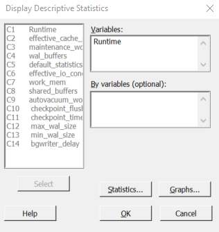
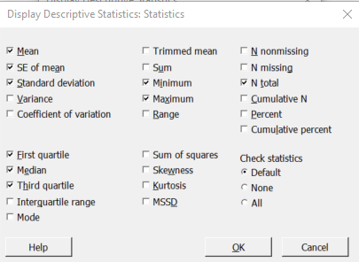
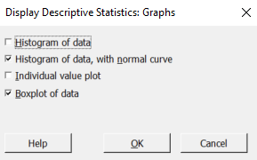
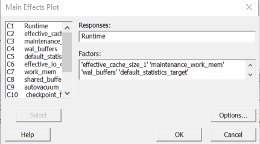

# README.md

## What Need to Be Done Before Start?

1. Pick RDBMS
2. Pick a representative dataset
3. Figure out the representative workload with picked dataset


## Load Config File 

Export\(or copy and paste\) config file from the application that you want to test. For example, to test PostgreSQL, copy parameter name, setting, minimum value and maximum value from table pg\_settings with following SQL command:

```sql
select name, setting, min_val, max_val from pg_settings;
```

While using function readfile in the program, put the name of config file in single quotes. 

```
 readfile('numerical_config.csv.small')
```


Put exported config file in the same folder with the program. 


## Run Test

Create an empty table with needed column names and data type before loading data into database. The SQL command used to create an empty table is in the file createtable.sql under folder preparation. 

Insert the SQL commands that you think can represent the complexity of work\(aka, "representative workload" \) into the function workload. 

Change the content in cur.execute\(\) into desired commands.   

```python
def workload(file,table_name):

    print("load the data into the db")
    #params_name =               ["tcp_keepalives_count","cursors"]
    with open('./'+ file, 'r') as f:
        reader = csv.reader(f)
        next(reader)  # Skip the header row.
        for row in reader:
            cur.execute( 'INSERT INTO '+ table_name +' VALUES (%s,%s,%s,%s,%s,%s,%s,%s,%s,%s,%s,%s,%s,%s,%s,%s,%s,%s,%s,%s,%s,%s,%s,%s,%s,%s,%s,%s,%s,%s,%s,%s,%s,%s,%s,%s,%s,%s,%s,%s,%s,%s,%s,%s,%s,%s,%s,%s,%s,%s,%s,%s,%s,%s,%s)',
                        row
                       )
    #sql statement
    print("run the select")
    cur.execute("select * from sof a, sof b, sof c where not a.undergradmajor ~ '[mM]ath' and not b.hopefiveyears ~ '[Ww]ork' and not c.hopefiveyears ~ 'calender' and not a.devtype ~ '[fF]ull-stack' and not b.country ~ 'Kenya';")
    return

```


Also, % symbol in for loop corresponding to how many columns you have in the selected dataset. For example, in the dataset I selected, there were 26 columns, so there are 26 % symbols in VALUES\(\) function. Don't forget to change that if you have more than 26 columns. 


## Analysis 

The guideline is based on software Minitab. 

### Descriptive Statistics and Graphs  

STEP 1 : Select Stat &gt; Basic Statistics &gt; Display Descriptive Statics. Click text box under "Variable", then double click Runtime to add it as a variable. 



STEP 2: Click button "Statistics", uncheck "N nonmissing" and "N missing". Click OK. 



STEP 3: Click button "Graphs", check "Histogram of data, with normal curve" and "Boxplot of data". Then click OK. 



STEP 4: Click OK to generate descriptive statistics and graphs. 


### Main Effects Plots

Click Stat &gt; ANOVA &gt; Main Effects Plot. Add "Runtime" as Response, and the others as Factors. And then click OK. 




 After implementing main effects plots, it's necessary to use ANOVA analysis to make sure the main effect is statistically significant, rather than caused by random chance. 


## Conclusion 

As you can see, load file into the program and run test are modularized and can run automatically. However, the analysis part still needs some manual work. The software Minitab that I used for analytics is not free, so I would recommend these Python packages for further analysis. 

Pandas - [http://pandas.pydata.org/](http://pandas.pydata.org/)

Statsmodels- [http://www.statsmodels.org/stable/index.html](http://www.statsmodels.org/stable/index.html)

Seaborn - [http://seaborn.pydata.org/index.html](http://seaborn.pydata.org/index.html)

Matplotlib - [https://matplotlib.org/index.html](https://matplotlib.org/index.html)

Please feel free to fork this repository, change it for better use, build on it or use any part of this program!!  I would love to give my special thanks to my mentor Justin Dowdy for his help to put this project together! Also huge thanks to everyone who have helped me during my internship!  

